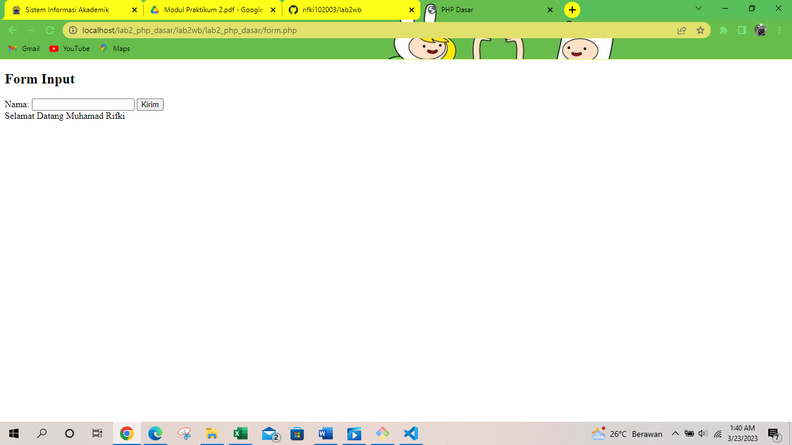
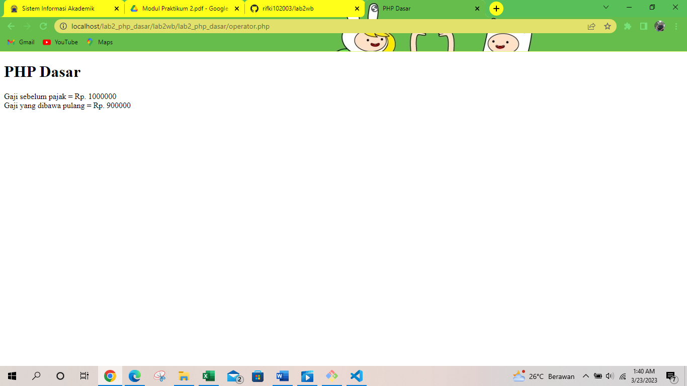
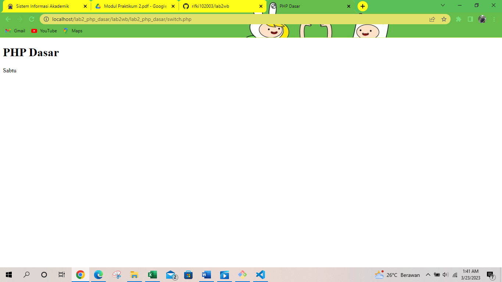
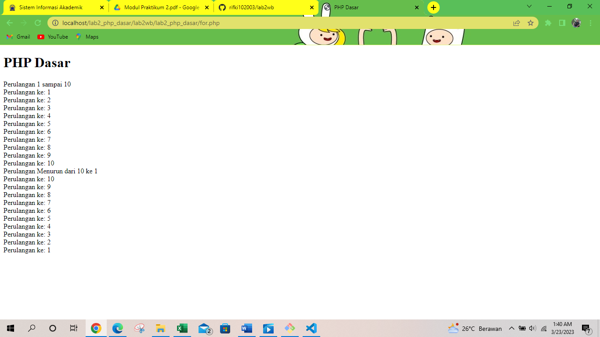
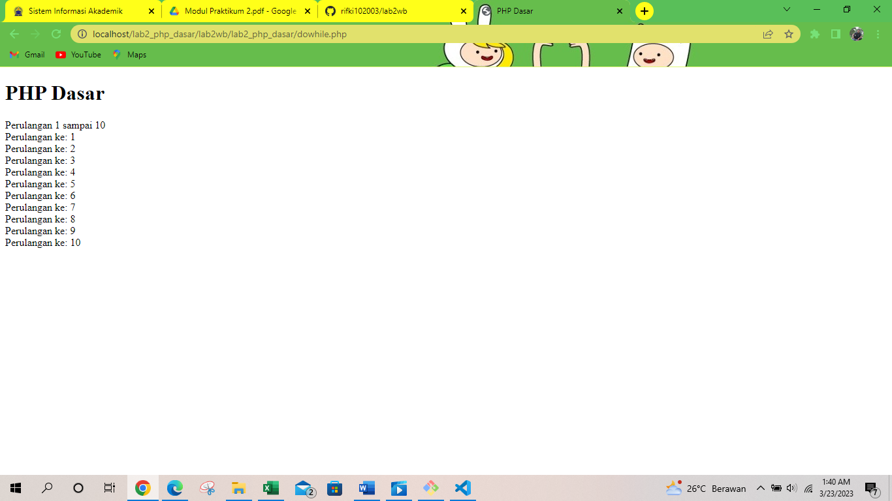
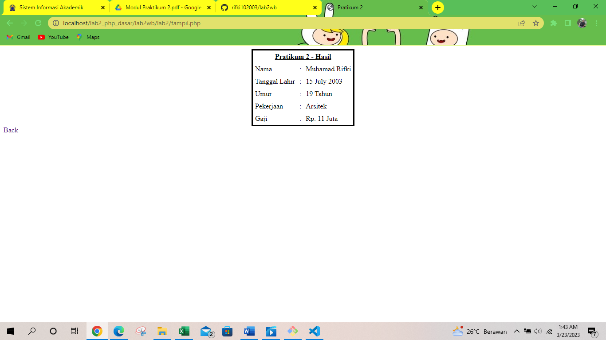

# lab2wb
## PRAKTIKUM
### PEMOGRAMAN WEB
BERIKUT HASIL DARI PRAKTIKUM
            
            
PHP DASAR DENGAN VARIABLE

            <!DOCTYPE html>
            <html lang="en">
            <head>
            <meta charset="UTF-8">
            <title>PHP Dasar</title>
            </head>
            <body>
            <h1>Belajar PHP Dasar</h1>
            <?php
            echo "Hello World";
            ?>
            </body>
            </html>
Hasil nya'
'

BERIKUT HASIL DARI Predefine Variable $_GET'
'

            <?php
            echo 'Selamat Datang ' . $_GET['nama'];
            ?>

        <!DOCTYPE html>
        <html lang="en">
            <head>
                <meta charset="UTF-8">
                <title>PHP Dasar</title>
            </head>
            <body>    
                <h1>Predefine variable</h1>
                <?php
                    echo 'Selamat Datang ' . $_GET['nama'];
                ?>
            </body>
        </html>

HASIL OUTPUTNYA'
'

MEMBUAT FORM INPUT '
'

            <!DOCTYPE html>
            <html lang="en">
            <head>
            <meta charset="UTF-8">
            <title>PHP Dasar</title>
            </head>
            <body>
            <h2>Form Input</h2>
            <form method="post">
            <label>Nama: </label>
            <input type="text" name="nama">
            <input type="submit" value="Kirim">
            </form>
            <?php
            echo 'Selamat Datang ' . $_POST['nama'];
            ?>
            </body>
            </html>
BERIKUT HASIL OUTPUTNYA'
'

OPRATOR'
'
            <?php
            $gaji = 1000000;
            $pajak = 0.1;
            $thp = $gaji - ($gaji*$pajak);
            echo "Gaji sebelum pajak = Rp. $gaji  ";
            echo "Gaji yang dibawa pulang = Rp. $thp";
            ?>
BERIKUT HASIL OUTPUTNYA'
'

KONDISI IF '
'
            <?php
            $nama_hari = date("l");
            if ($nama_hari == "Sunday") {
            echo "Minggu";
            } elseif ($nama_hari == "Monday") {
            echo "Senin";
            } else {
            echo "Selasa";
            }
            ?>
BERIKUT HASIL OUTPUTNYA'
'

KONDISI SWITCH'
'

                <?php
                $nama_hari = date("l");
                switch ($nama_hari) {
                case "Sunday":
                echo "Minggu";
                break;
                case "Monday":
                echo "Senin";
                break;
                case "Tuesday":
                echo "Selasa";
                break;
                default:
                echo "Sabtu";
                ?>
BERIKUT HASIL OUTPUTNYA'
'

PERULANGAN FOR'
'

                <?php
                echo "Perulangan 1 sampai 10  ";
                for ($i=1; $i<=10; $i++) {
                echo "Perulangan ke: " . $i . ' ';
                }
                echo "Perulangan Menurun dari 10 ke 1  ";
                for ($i=10; $i>=1; $i--) {
                echo "Perulangan ke: " . $i . ' ';
                }
                ?>
BERIKUT HASIL OUTPUT NYA'

PERULANGAN WHILE'
'

                <?php
                echo "Perulangan 1 sampai 10  ";
                $i=1;
                while ($i<=10) {
                echo "Perulangan ke: " . $i . ' ';
                $i++;
                }
                ?>
BERIKUT HASIL OUTPUTNYA'
'

PERULANGAN DOWHILE'
'

                <?php
                echo "Perulangan 1 sampai 10  ";
                $i=1;
                do {
                echo "Perulangan ke: " . $i . ' ';
                $i++;
                } while ($i<=10);
                ?>
BERIKUT HASIL OUTPUTNYA'
'

## TugasBuatlah program PHP sederhana dengan menggunakan form input yang menampilkan nama, tanggal lahir dan pekerjaan. Kemudian tampilkan outputnya dengan menghitung umur berdasarkan inputan tanggal lahir. Dan pilihan pekerjaan dengan gaji yang berbeda-beda sesuai pilihan pekerjaan.

FILE INDEX.PHP

            <!DOCTYPE html>
            <html lang="en">
            <head>
                <meta charset="UTF-8">
                <meta http-equiv="X-UA-Compatible" content="IE=edge">
                <meta name="viewport" content="width=device-width, initial-scale=1.0">
                <title>Pratikum 2</title>
            </head>
            <body>
                <form action="tampil.php" method="POST"> 
                    <table align="center" cellspacing="0" cellpadding="5" bordercolor="black"> 
                        <tr> 
                            <th colspan="3"><u>Pratikum 2 - PHP Dasar</u></th> 
                        </tr> 
                        <tr> 
                            <td>Nama</td> 
                            <td>:</td> 
                            <td><input type="text" name="nama" placeholder="Nama Anda" /></td>
                        </tr> 
                        <tr> 
                            <td>Tanggal Lahir</td> 
                            <td>:</td> 
                            <td><input type="date" name="tgl" placeholder="TanggaL Lahir"></td>
                        </tr>  
                        <tr>
                            <td>Pekerjaan</td> 
                            <td>:</td> 
                            <td><select name="kerja"> 
                                <option selected disabled>Pilih Pekerjaan...</option> 
                                <option value="Programmer">Programmer</option> 
                                <option value="Guru">Guru</option> 
                                <option value="Dokter">Dokter</option>
                                <option value="Arsitek">Arsitek</option> 
                                </select>
                            </td> 
                        </tr>  
                        <tr> 
                            <th colspan="3"> 
                                <input type="submit" value="Simpan"> 
                                <input type="reset" value="Reset"> 
                            </th> 
                        </tr> 
                    </table> 
                </form> 
            </body>
            </html>

OUTPUT NYA '
'

# # # TAMPILAN.PHP

# KODINGAN NYA:

            <!DOCTYPE html>
            <html lang="en">
            <head>
                <meta charset="UTF-8">
                <meta http-equiv="X-UA-Compatible" content="IE=edge">
                <meta name="viewport" content="width=device-width, initial-scale=1.0">
                <title>Pratikum 2</title>
            </head>
            <body>

            <?php
            $nama = @$_POST['nama'];
            $tanggal_lahir = date_format(date_create(@$_POST['tgl']), "d F Y");
            $lahir = new DateTime(@$_POST['tgl']);
            $sekarang = new DateTime('today');
            $umur = $sekarang->diff($lahir)->y;   
            $kerja = $_POST['kerja'];
            $gaji = "";

            switch ($kerja) {
                case 'Programmer';
                    $gaji = "Rp. 17 Juta";
                    break;

                case 'Guru';
                    $gaji = "Rp. 7 Juta";
                    break; 
                    
                case 'Dokter';
                    $gaji = "Rp. 8 Juta";
                    break;

                case 'Arsitek';
                    $gaji = "Rp. 11 Juta";
                    break;

                default;
                    $gaji = '0';
                    break;
            }
            ?>

            <table align="center" cellspacing="0" cellpadding="5" bordercolor="black"> 
                <tr> 
                    <th colspan="3"><u>Pratikum 2 - Hasil</u></th> 
                    </tr> 
                        <tr> 
                            <td>Nama</td> 
                            <td>:</td> 
                            <td> <?= $nama ?> </td>
                        </tr>
                        <tr>
                            <td>Tanggal Lahir</td> 
                            <td>:</td> 
                            <td> <?= $tanggal_lahir ?> </td> 
                        </tr>    
                        <tr>
                            <td>Umur</td> 
                            <td>:</td> 
                            <td> <?= $umur ?> Tahun </td> 
                        </tr>  
                        <tr>
                            <td>Pekerjaan</td> 
                            <td>:</td> 
                            <td> <?= $kerja ?> </td> 
                        </tr> 
                        <tr>
                            <td>Gaji</td> 
                            <td>:</td> 
                            <td> <?= $gaji ?> </td> 
                        </tr> 
            </table>
            <a href="index.php">Back</a> 
            </body>
            </html>
 BERIKUT OUT PUTNYA:
 

# TERIMAKASIH