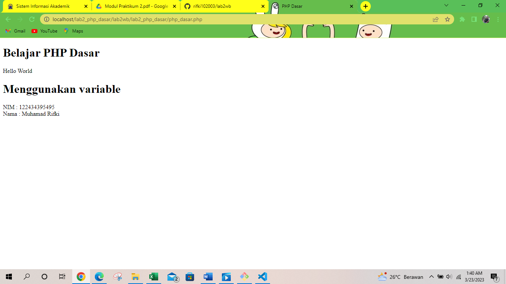
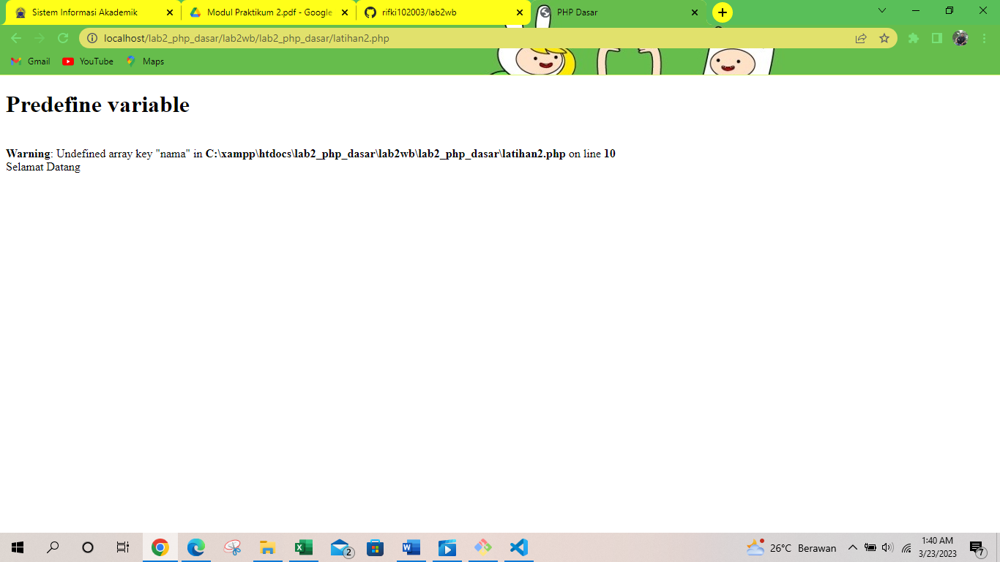

# lab2wb
## PRAKTIKUM
### PEMOGRAMAN WEB
BERIKUT HASIL DARI PRAKTIKUM
            
            
PHP DASAR DENGAN VARIABLE

            <!DOCTYPE html>
            <html lang="en">
            <head>
            <meta charset="UTF-8">
            <title>PHP Dasar</title>
            </head>
            <body>
            <h1>Belajar PHP Dasar</h1>
            <?php
            echo "Hello World";
            ?>
            </body>
            </html>
Hasil nya'
'

BERIKUT HASIL DARI Predefine Variable $_GET'
'

            <?php
            echo 'Selamat Datang ' . $_GET['nama'];
            ?>

        <!DOCTYPE html>
        <html lang="en">
            <head>
                <meta charset="UTF-8">
                <title>PHP Dasar</title>
            </head>
            <body>    
                <h1>Predefine variable</h1>
                <?php
                    echo 'Selamat Datang ' . $_GET['nama'];
                ?>
            </body>
        </html>

HASIL OUTPUTNYA'
'

MEMBUAT FORM INPUT '
'

            <!DOCTYPE html>
            <html lang="en">
            <head>
            <meta charset="UTF-8">
            <title>PHP Dasar</title>
            </head>
            <body>
            <h2>Form Input</h2>
            <form method="post">
            <label>Nama: </label>
            <input type="text" name="nama">
            <input type="submit" value="Kirim">
            </form>
            <?php
            echo 'Selamat Datang ' . $_POST['nama'];
            ?>
            </body>
            </html>
BERIKUT HASIL OUTPUTNYA'
'

![img]Screenshot/FORM.png

OPRATOR'
'
            <?php
            $gaji = 1000000;
            $pajak = 0.1;
            $thp = $gaji - ($gaji*$pajak);
            echo "Gaji sebelum pajak = Rp. $gaji  ";
            echo "Gaji yang dibawa pulang = Rp. $thp";
            ?>
BERIKUT HASIL OUTPUTNYA'
'

![img]Screenshot/OPRATOR.png

KONDISI IF '
'
            <?php
            $nama_hari = date("l");
            if ($nama_hari == "Sunday") {
            echo "Minggu";
            } elseif ($nama_hari == "Monday") {
            echo "Senin";
            } else {
            echo "Selasa";
            }
            ?>
BERIKUT HASIL OUTPUTNYA'
'

![img]Screenshot/IF.png

KONDISI SWITCH'
'

                <?php
                $nama_hari = date("l");
                switch ($nama_hari) {
                case "Sunday":
                echo "Minggu";
                break;
                case "Monday":
                echo "Senin";
                break;
                case "Tuesday":
                echo "Selasa";
                break;
                default:
                echo "Sabtu";
                ?>
BERIKUT HASIL OUTPUTNYA'
'
![img]Screenshot/SWITCH.png

PERULANGAN FOR'
'

                <?php
                echo "Perulangan 1 sampai 10  ";
                for ($i=1; $i<=10; $i++) {
                echo "Perulangan ke: " . $i . ' ';
                }
                echo "Perulangan Menurun dari 10 ke 1  ";
                for ($i=10; $i>=1; $i--) {
                echo "Perulangan ke: " . $i . ' ';
                }
                ?>
BERIKUT HASIL OUTPUT NYA'

![img]Screenshot/FOR.png

PERULANGAN WHILE'
'

                <?php
                echo "Perulangan 1 sampai 10  ";
                $i=1;
                while ($i<=10) {
                echo "Perulangan ke: " . $i . ' ';
                $i++;
                }
                ?>
BERIKUT HASIL OUTPUTNYA'
'

![img]Screenshot/WHILE.png

PERULANGAN DOWHILE'
'

                <?php
                echo "Perulangan 1 sampai 10  ";
                $i=1;
                do {
                echo "Perulangan ke: " . $i . ' ';
                $i++;
                } while ($i<=10);
                ?>
BERIKUT HASIL OUTPUTNYA'
'

![img]Screenshot/DOWHILE.png

